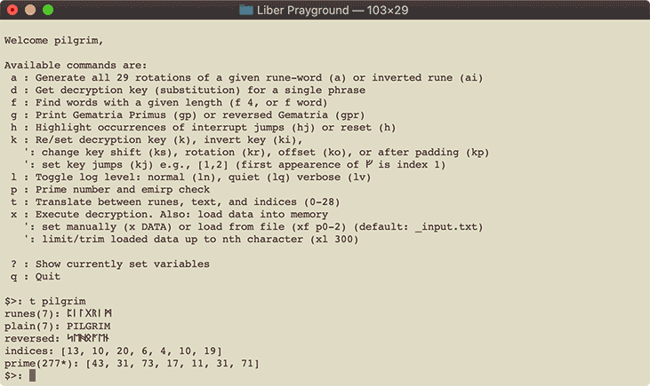
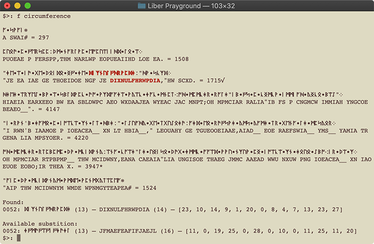
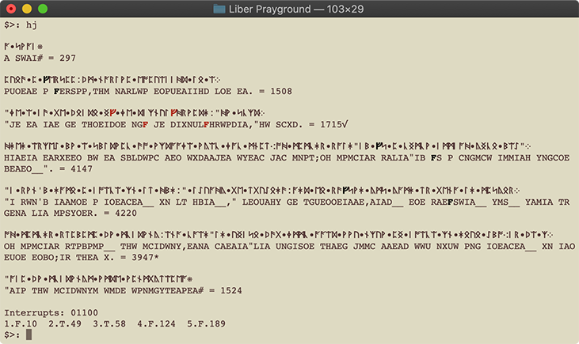

# Liber Prayground



## Quick Overview

### Main components:

- `playground.py` this is where you want to start. Simply run it and it will great you with all the posibilities. Use this if you want to experiment, translate runes, check for primes, etc. See [Playground](#playground) for more info.

- `solver.py` you can run `solver.py -s` to output all already solved pages. Other than that, this is the playground to test new ideas against the unsolved pages. Here you can automate stuff and test it on all the remaining pages; e.g., there is a section to try out totient functions. See [Solving](#solving) for more info.

- `probability.py` some tools for rune frequency analysis, interrupt detector, and Vigenere / Affine breaker. These tools will try to guess the key length of the cipher and determine the most probable key shift per key group. See [Heuristics](#heuristics) for more info.

You can call `playground.py` and `solver.py` with command line arguments `-v` or `-q` (or both), to control the verbosity of the output (see [Log levels](#l-log-levels)).


### LP pages and notation

The `pages` folder contains all LP pages in text and graphic. Note, I have double checked each and every rune while copying and added missing whitespace characters like `'` and `"`.

Rune values are taken from Gematria, with these unicode characters representing: space (`•`), period (`⁘`), comma (`⁚`), semicolon (`⁖`), and chapter mark (`⁜`).


### The library

These files you probably wont need to touch unless you want to modify some output behavior or rune handling. E.g. if you want to add a rune multiply method. These are the building blocks for the main components.

- `lib.py`, a small collection of reusable functions like `is_prime` and `rev` for emirp (reverse prime) checking.

- `RuneText.py` is the representation layer. The class `RuneText` holds an array of `Rune` objects, which represent the individual runes. Each `Rune` has the attributes `rune`, `text`, `prime`, `index`, and `kind` (see [Solving](#solving)).

- `RuneRunner.py` is a collection of classes that handles data input as well as ouput to stdout. It does all the word sum calculations, prime word detection, line sums, and output formatting (including colors). Everything you don't want to worry about when processing the actual runes.

- `RuneSolver.py` contains a specific implementation for each cipher type. Two implementations in particular, `VigenereSolver` which has methods for setting and modifying key material as well as automatic key rotation and interrupt skipping. `SequenceSolver` interprets the cipher on a continuous or discrete function (i.e., Euler's totient).

Refer to `solver.py` or section [Solving](#solving) for examples on usage.


## Playground

In general, the playground accepts any kind of data. Be it runes, plain text, or comma separated list of indices. So for all commands below you can use whatever<sup>1</sup> you have currently in your clipboard.

<small><sup>1</sup> not primes though, because how would you differentiate an index from a prime?</small>

The command `help` will display:

```
Available commands are:
 a : Generate all 29 rotations of a given rune-word (a) or inverted rune (ai)
 d : Get decryption key (substitution) for a single phrase
 f : Find words with a given length (f 4, or f word)
 g : Print Gematria Primus (gp) or reversed Gematria (gpr)
 h : Highlight occurrences of interrupt jumps (hj) or reset (h)
 k : Re/set decryption key (k), invert key (ki),
   ': change key shift (ks), rotation (kr), offset (ko), or after padding (kp)
   ': set key jumps (kj) e.g., [1,2] (first appearence of ᚠ is index 1)
 l : Toggle log level: normal (ln), quiet (lq) verbose (lv)
 p : Prime number and emirp check
 t : Translate between runes, text, and indices (0-28)
 x : Execute decryption. Also: load data into memory
   ': set manually (x DATA) or load from file (xf p0-2) (default: _input.txt)
   ': limit/trim loaded data up to nth character (xl 300)

 ? : Show currently set variables
 q : Quit
```


### a) Generate 29 variants

Input a string (as said above, anything goes) and it will output all variations with the runes rotated by 1, 2, ..., 28

```
$>: a Hello world
00: ᚻᛖᛚᛚᚩ•ᚹᚩᚱᛚᛞ – HELLO WORLD – [8, 18, 20, 20, 3, 7, 3, 4, 20, 23]
01: ᚾᛗᛝᛝᚱ•ᚻᚱᚳᛝᚪ – NMNGNGR HRCNGA – [9, 19, 21, 21, 4, 8, 4, 5, 21, 24]
...
28: ᚹᛒᛗᛗᚦ•ᚷᚦᚩᛗᛟ – WBMMTH GTHOMOE – [7, 17, 19, 19, 2, 6, 2, 3, 19, 22]
```

or use `ai` to do the same but invert the string prior.

```
$>: ai Hello world
00: ᛚᛁᚻᚻᚫ•ᛝᚫᚪᚻᚳ – LIHHAE NGAEAHC – [20, 10, 8, 8, 25, 21, 25, 24, 8, 5]
01: ᛝᛄᚾᚾᚣ•ᛟᚣᚫᚾᚷ – NGJNNY OEYAENG – [21, 11, 9, 9, 26, 22, 26, 25, 9, 6]
...
28: ᛗᚾᚹᚹᚪ•ᛚᚪᛞᚹᚱ – MNWWA LADWR – [19, 9, 7, 7, 24, 20, 24, 23, 7, 4]
```

On both you can add `q` to omit the indices.

```
$>: aqi Hello world
00: ᛚᛁᚻᚻᚫ•ᛝᚫᚪᚻᚳ – LIHHAE NGAEAHC
01: ᛝᛄᚾᚾᚣ•ᛟᚣᚫᚾᚷ – NGJNNY OEYAENG
...
28: ᛗᚾᚹᚹᚪ•ᛚᚪᛞᚹᚱ – MNWWA LADWR
```


### d) Decrypt string

The title is misleading. What it actually does, it calculates the difference between the two strings. First you input some part of the page, then you type what you think it should be translated to. The software does the calculation.

```
$>: d ᚪ•ᛋᚹᚪᛁ
encrypted: ᚪ•ᛋᚹᚪᛁ – A SWAI – [24, 15, 7, 24, 10]
What should the decrypted clear text be?: a koan
plaintext: ᚪ•ᚳᚩᚪᚾ – A KOAN – [24, 5, 3, 24, 9]
Substition:
ᚠ•ᛁᚱᚠᚢ – F IRFU – [0, 10, 4, 0, 1]
```


### f) Find words

This will search for words of a given length. You may pass either a number (`f 7`) which will hightlight all 7-rune words or search with a given word. In the latter case it will also provide the substitution for that word, e.g., `f pilgrim`.




### g) Gematria Primus

Print Gematria in either normal order (`gp`) or reversed order (`gpr`).

```
$>: gpr
Gematria Primus (reversed)
 0  ᛠ 109  EA          15  ᛈ  43  P
 1  ᛡ 107  IO/IA       16  ᛇ  41  EO
 2  ᚣ 103  Y           17  ᛄ  37  J
 3  ᚫ 101  AE          18  ᛁ  31  I
 4  ᚪ  97  A           19  ᚾ  29  N
 5  ᛞ  89  D           20  ᚻ  23  H
 6  ᛟ  83  OE          21  ᚹ  19  W
 7  ᛝ  79  ING/NG      22  ᚷ  17  G
 8  ᛚ  73  L           23  ᚳ  13  K/C
 9  ᛗ  71  M           24  ᚱ  11  R
10  ᛖ  67  E           25  ᚩ   7  O
11  ᛒ  61  B           26  ᚦ   5  TH
12  ᛏ  59  T           27  ᚢ   3  V/U
13  ᛋ  53  Z/S         28  ᚠ   2  F
14  ᛉ  47  X
```


### h) Hightlight occurrences

Highlighting is currently very limited. The only supported option is `hj` which will hightlight all interrupts. That is, it will hightlight all occurrences of `ᚠ` in the text and mark those that are actively skipped or jumped over.




### k) Key manipulation

The playground allows you to modify the key in various ways. Here is a somewhat graphical representation of the individual commands:

```
$>: k HELLOFUN
set key: [8, 18, 20, 20, 3, 0, 1, 9]
$> ki   -> [20, 10, 8, 8, 25, 28, 27, 19]
$> ks 2 -> [20, 20, 3, 0, 1, 9, 8, 18]
$> kr 4 -> [12, 22, 24, 24, 7, 4, 5, 13]
$> kp 3 -> [8, 18, 20, 20, 3, 0, 1, 9, 29, 29, 29]
$> ko 1 -> [29, 8, 18, 20, 20, 3, 0, 1, 9]
```

Combining all of the above will give:

```
[29, 12, 12, 0, 3, 2, 23, 24, 14, 29, 29, 29]
```

The key length is the sum of user-set-key + offset + padding. Shift and rotate only affect the user set key, not the padding or offset.

__Note:__ Index 29 is used as placeholder here. A value of 29 will not affect the decryption calculation whatsoever. If a (vigenere) key is set, they key will be split into an active part (values != 29) and an inactive part (values == 29). The output will mark all active runes in red<sup>2</sup>.

<small><sup>2</sup> Totient functions currently do not support highlighting because there is no part that is "not active".</small>

#### Key interrupts / key jumps

Some solutions require you to ignore specific `ᚠ` in the clear text. For example, the solution to jpg 107–167 skips the F rune at position 49 and 58 (ignoring whitespace). You can set these from within the playground.

To make things easier, you don't have to use the exact position. Simply used the nth-occurrence of the interrupt. E.g., in the above example you can set the interrupts with `kj 2,3` (the first occurrence would be index 1).


### l) Log levels

Liber Prayground currently supports two log levels. Verbose (`lv` or `-v` as CLI args), which will add the prime values of each rune and the sum for each word. And log level Quiet (`lq` or `-q` via CLI), which will hide the runes from the ouput. You can combine both.

```
$>: lv

ᚻᛖᚣ•ᚹᚩᚱᛚᛞ
H  E  Y   W  O R  L  D
23+67+103 19+7+11+73+89
193* + 199* = 392√

$>: ln

ᚻᛖᚣ•ᚹᚩᚱᛚᛞ
HEY__ WORLD__ = 392√

$>: lq
HEY WORLD
```

Words which sum up to a prime will be marked. Depending on the log mode the word sum is marked with an asterisk (`*`) in verbose, or a double underscore (`__`) in normal mode after the word. In both cases a total sum of the sentence is shown at the end. If that sentence sum is equal to a prime it is marked with an asterisk as well. And if the reverse number is also a prime (emirp) then the sentence is additionally marked with a root square sign (`√`); in the example above 293 is a prime.


### p) Prime test

Short and simple. Tests for both, prime and emirp.

```
$>: p 3301
3301 : True
1033 : True
```

### t) Translate

Put anything in, get everything out.

```
$>: t cicada
runes(6): ᚳᛁᚳᚪᛞᚪ
plain(6): CICADA
reversed: ᛞᛖᛞᚱᚳᚱ
indices: [5, 10, 5, 24, 23, 24]
prime(340): [13, 31, 13, 97, 89, 97]
```

As described in [log levels](#l-log-levels), if the number inside prime() is prime it will display a `*` and/or `√`. The number inside runes() and plain() is just the length of the string.


### x) Execute decryption and load data

Running `x` on its own will decrypt and display the currently loaded data. You can manually set the data by running `x Hello world`. There is also `xf` which will load the content of the `_input.txt` file – or a specific book chapter if you provide it (`x p3-7`). 

If the output is too long, you can limit (the already loaded data) with `xl 180`. Where 180 is the number of characters to display. If the loaded data is a file, you can increase the limit again (or remove it with `xl`). If the loaded data is manually set, the data is lost forever.


## Solving

### Rune and RuneText

`Rune.kind` can be one of `r n s l w` – meaning (r)une, (n)umber, (s)entence, (l)ine, or (w)hitespace. A line is what you see in the source file (which is equivalent to a line in the original jpg page). A sentence is one that ends with a period (`⁘`).

`Rune` as well as `RuneText` both support simple arithmetic operations: `Rune(i=2) - 2` will yield a `ᚠ` rune. For example, you can invert a text with `28 - RuneText('test me')` or simply `~RuneText('inverted')`.

__Note:__ Always initialize a rune with its rune character or its index, never ASCII or its prime value.


### RuneRunner and I/O

`RuneRunner` has two noteworthy attributes `input` and `output`; `RuneReader` and `RuneWriter` respectively. Use the former to load data into memory:

```
solver.load(file='p33.txt')
solver.load(data='will be parsed')
solver.load(RuneText('will be copied'))
```

The output writer has the options `COLORS`, `VERBOSE`, `QUIET`, and `BREAK_MODE` to control the appearance. `BREAK_MODE` can be one of the `Rune.kind` values.


### RuneSolver, VigenereSolver, SequenceSolver, AffineSolver
 
All `RuneSolver` subclasses inherit the attributes of `RuneRunner` and will include additional data fields that can be set. In its most basic form it has the two fields `INTERRUPT` (must be rune) and `INTERRUPT_POS` (list of indices).

In the case of `VigenereSolver` the additional fields are `KEY_DATA` (list of indices), `KEY_INVERT` (bool), `KEY_SHIFT` (int), `KEY_ROTATE` (int), `KEY_OFFSET` (int), and `KEY_POST_PAD` (int).

The class `SequenceSolver` has only one additional parameter which is `FN` (function pointer or lambda expression).

`AffineSolver` is very similar to `VigenereSolver` but does not support key manipulation (yet). `KEY_DATA` and `KEY_INVERT` are the only two attributes.


## Heuristics

This is where the magic happens. `HeuristicLib.py` contains the basic frequency analysis metrics like Index of Coincidence (IoC) and similarity matching. The latter is used to automatically detect key shifts – like in Vigenere or Affine. These metrics are based on english sample texts, in this case “Peace and War” or “Gadsby” (text without the letter ‘e’ [well almost, because there are still 6 e's in there ... liar!]).

`NGrams.py` is respobsible for taking english text (or any other language) and translating it to runes. Also, counts runes in a text and creates the frequency distribution. The translation is the slowest part, but still very efficient. Creating all 1-gram to 5-grams of a 7 Mb text file takes approx. 20 sec.

`FailedAttempts.py` is a collection of what the title is saying – failed attempts. Currently only holds a n-gram shifter. Which will shift every n runes in contrast to the normal decrypting of a single rune at a time.


#### GuessVigenere, GuessAffine

Two classes that enumerate all possible shifts for a key. For Vigenere that is key length * 29, for Affine key length * 29^2. To determine whether one shift is more likely than another, a similarity metric is used. In this case, the least square distance to a normal english distribution. The value will be lowest if it closely matches the frequencies of each rune.


### HeuristicSearch.py

This is the heart of the interrupt detector. Searching the full set of possible constellations is not feasable (2 ^ {number of possible interrupts}). Thus, the class has two methods to avoid the full search. Both come with a maximum look ahead parameter that can be tweaked.

Lets look at an example with 66 interrupts (p8–14).  
Testing all would require 2^66 or __7.4*10^19__ calculations.

#### SearchInterrupt.sequential

This will go through the text sequentially. Looking at the first N interrupts and try all combinations in this subset. The best combination will determine whether the current interrupt (1. interrupt index) should be added to the final result. If the current index was used to generate the best value then it is included otherwise not. __Note:__ it will only add the first interrupt, not all of them. The next iteration will look at the interrupts at index 1 to N+1. Adding the next index if it was in the set, and repeating with the remaining text.

With a look ahead of 9 (default value), we have to do (66-8)*2^9 calculations, or __3.0\*10^4__.

#### SearchInterrupt.genetic

The genetic approach will look at all interrupts, but only change up to N interrupts at a time. If the look ahead is 4, the algorithm will look at all possible combinations with that will change (up to) 4 interrupts. The best combination is selected and the algorithm repeats. If no better solution is found, the currently best interrupt-set will be returned.

As an optimization, smaller look ahead levels are tried first. E.g., if you specify a look ahead of 4, levels 1, 2, and 3 are tried first. The level tells you how many interrupts will be tried simultaniously. Interrupts are like bits and can be flipped either on or off, even multiple times, in a search.

The complexity is not linear and depends on whether “there was just another better solution”. With the default look ahead of 3, which can flip 3 bits simultaneously, each step performs 66!/(3!(66-3)!) + 66!/(2!(66-2)!) + 66 operations or __4.8*10^4__. Usually it takes no more than 2–3 steps.


### InterruptDB.py

Calculating the best interrupt position takes quite long, so we can optimize our program by pre-calculating the IoC's. That is what `InterruptDB.py` is for. The class will search for the best interrupts and store the IoC score as well as the set of interrupts in a file. Later queries just need to process this file instead.

The current configuration will look at the first 20 interrupts, for all runes, on all pages, and up to a key length of 32 – thats 1.36*10^10 operations! The full execution time is somewhere around 38 hours. Luckily, it is a one-time job. The resulting database is used directly as is, plus a html file is generated by `InterruptToWeb` for a graphical representation. Meanwhile, `InterruptIndices` keeps count how reliable the results are, e.g., how many runes were considered when looking for the first 20 interrupts, and adds that information to the html. Here is the [html overview](./InterruptDB/).


### probability.py

As described in the introduction to this repository, `probability.py` is the third main entry to deciphering the Liber Primus. This includes a fully automated Affine (incl. Atbash, reverse Gematria, xor) and Vigenere breaker.

This is your playground to experiment with new automated decrypting and re-running previous tests on new interrupts. Contrary to `playground.py` (translation, search, key manipulation) and `solver.py` (automated testing of a specific idea or totient function), `probability.py` is about automated testing of ideas regarding heuristic metrics. E.g., how can you optimize the process so the program will drop the right answer automatically.